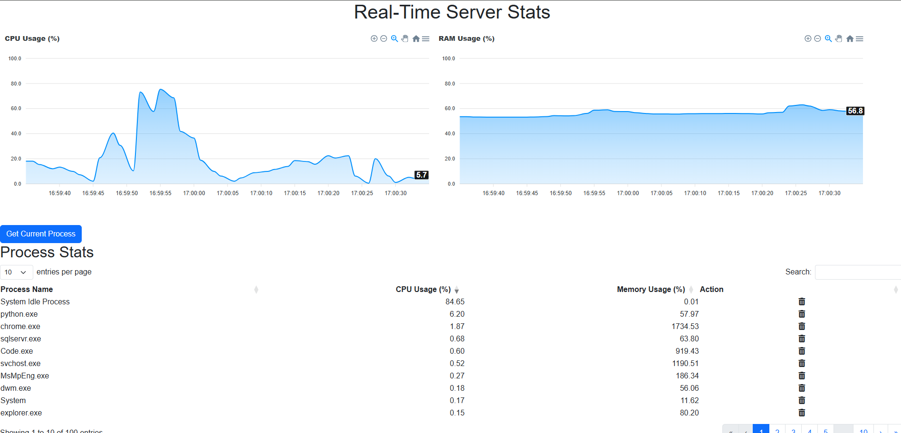

# WindowsServerStatsMonitoring

**WindowsServerStatsMonitoring** is a Flask-based web application designed to monitor and control system performance remotely. This app allows users to track CPU and memory usage, view real-time stats, and manage running processes on a remote Windows server. It uses Flask, Flask-SocketIO for real-time data, and psutil for fetching system statistics.

## Features

- **Real-time System Stats**: Displays the CPU and memory usage of the system in real time.
- **Process Monitoring**: Provides detailed stats for processes, including CPU and memory usage, and allows termination of processes.
- **Remote Control**: Admin can remotely monitor the server and terminate processes by their PID.
- **Web Interface**: A simple and intuitive frontend to interact with system stats and processes.
- **WebSocket Integration**: Pushes updates to the client in real time using Flask-SocketIO.

## Screenshots

Here are some screenshots of the app in action:


*System Stats Dashboard showing CPU and memory usage*

## Installation

Follow these steps to set up the app on your server.

### 1. Clone the Repository
```bash
git clone https://github.com/ErAnmolgurjar/WindowsServerStatsMonitoring.git
cd WindowsServerStatsMonitoring
```
### 2. Install Dependencies
```bash
pip install -r requirements.tx
```
### 3. Run the Application
```bash
python app.py
```
